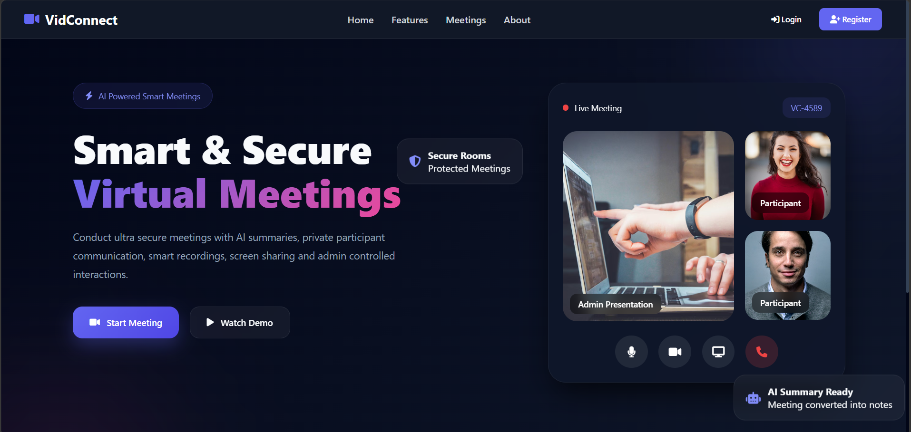
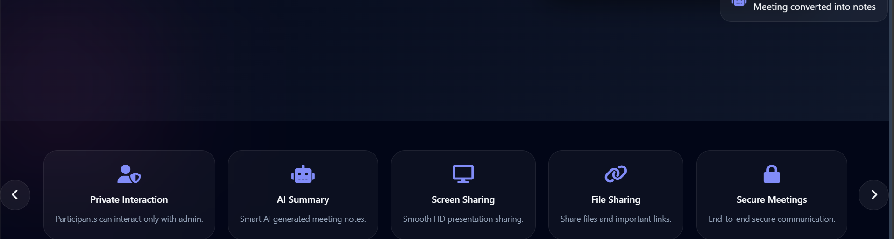
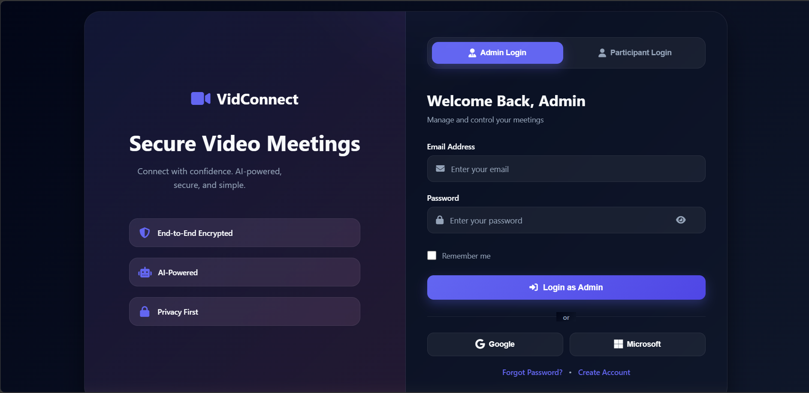
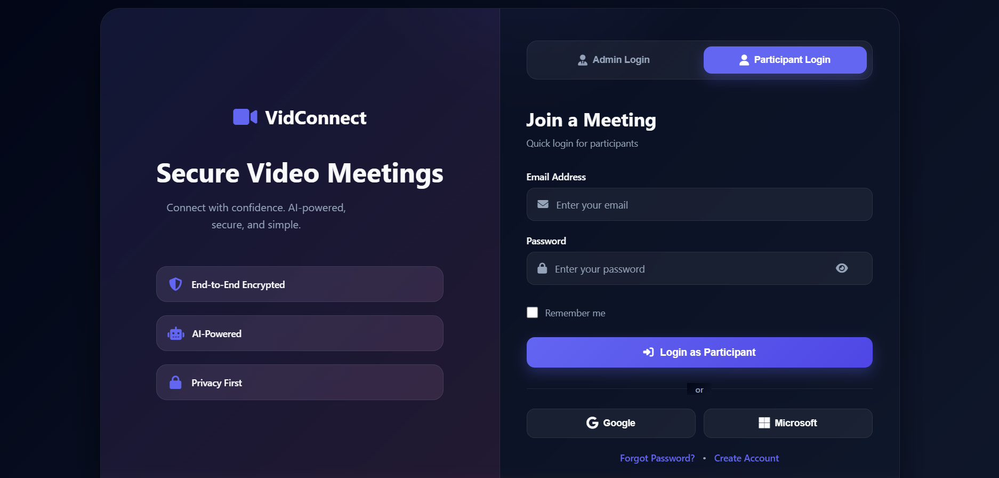
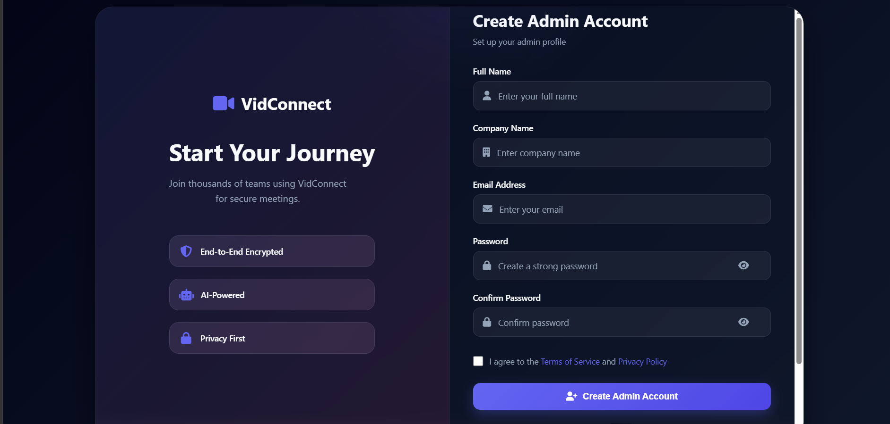
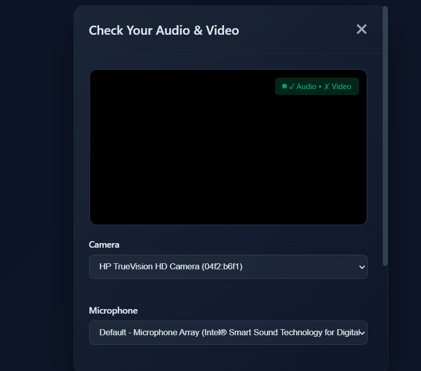
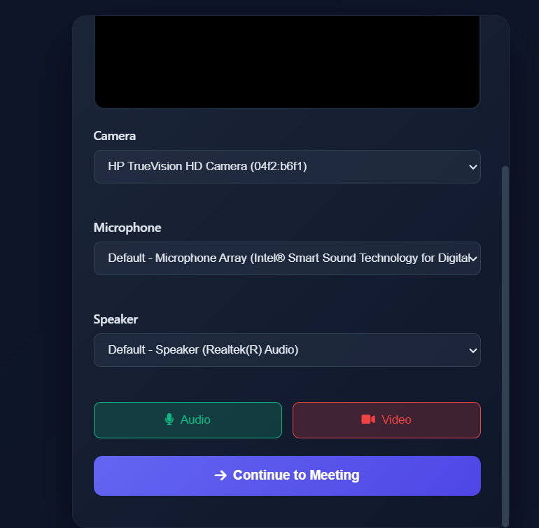
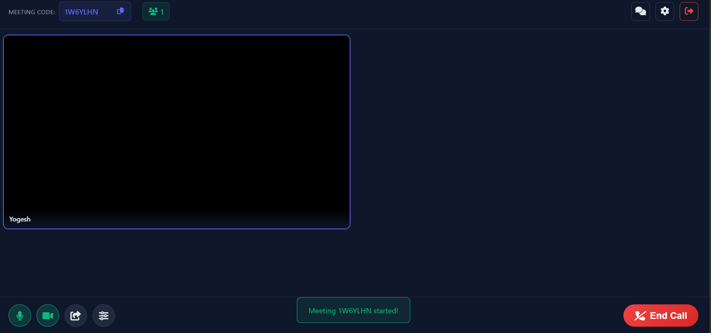
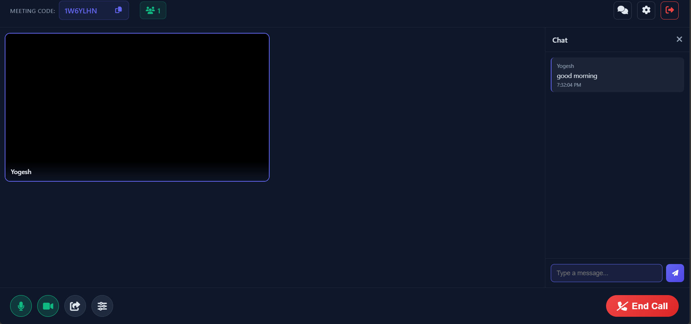

# VidConnect 🎥

A modern real-time video conferencing platform built using **Node.js, Express.js, WebRTC, Socket.IO, MongoDB, HTML, CSS, and JavaScript**.

VidConnect enables seamless video meetings with live communication, screen sharing, chat functionality, participant tracking, and media preview. The platform is designed around separate **Admin** and **Participant** workflows for better meeting management.

---

## ✨ Features

### 🏠 Homepage

* Modern responsive landing page
* Create Meeting
* Join Meeting
* Meeting code sharing
* Professional UI/UX

### 🔐 Authentication UI (Ready)

* Admin Login Interface
* Participant Login Interface
* Admin Registration Interface
* Role-based tab switching
* Authentication backend (JWT) planned

### 🎥 Video Conferencing

* Real-time video calling with WebRTC
* Peer-to-peer communication
* Low latency media streaming

### 👀 Media Preview

* Camera preview before joining
* Microphone status preview
* Device verification

### 🎙️ Audio Controls

* Mute / Unmute microphone
* Real-time media state updates

### 📹 Video Controls

* Camera On / Off
* Live stream management

### 🖥️ Screen Sharing

* Share screen during meetings
* Present slides and documents

### 💬 Real-Time Chat

* Socket.IO powered chat
* Instant message delivery

### 👥 Participant Management

* Live participant count
* Join / Leave notifications
* Real-time room updates

---

## 🏗️ Current Workflow

```text
Homepage
│
├── Create Meeting
│
├── Join Meeting
│
└── Login / Register
      │
      ├── Admin
      └── Participant

Meeting Room
│
├── Video Call
├── Audio Controls
├── Video Controls
├── Screen Sharing
├── Chat
├── Participant Count
└── Leave Meeting
```

---

## 🛠️ Tech Stack

### Frontend

* HTML5
* CSS3
* JavaScript (ES6)

### Backend

* Node.js
* Express.js

### Real-Time Communication

* WebRTC
* Socket.IO

### Database

* MongoDB
* Mongoose

### Development Tools

* Git
* GitHub

---

## 📸 Screenshots

### Homepage



### Homepage Features



### Homepage Meeting Options


### Admin Login



### Participant Login



### Admin Registration



### Media Preview



### Media Preview (Alternative)



### Meeting Room



### Chat System



---

## ⚙️ Installation

```bash
git clone https://github.com/YOUR_USERNAME/VidConnect.git

cd VidConnect

npm install

npm run dev
```

---

## 🚀 Upcoming Features

### Authentication & Authorization

* JWT Authentication
* Role-Based Authorization
* Protected Routes
* Session Management

### AI Features

* Speech-to-Text
* Meeting Summaries
* Real-Time Translation
* Text-to-Speech

### Advanced Features

* Meeting Recording
* File Sharing
* Meeting History
* Admin Dashboard
* Participant Dashboard

---

## 🎯 Project Goal

VidConnect aims to provide a lightweight, scalable, and feature-rich video conferencing platform powered by WebRTC and Socket.IO, with future AI-powered collaboration features.

---

## 👨‍💻 Developer

**Yogesh Singh**

If you found this project useful, consider giving it a ⭐ on GitHub.
